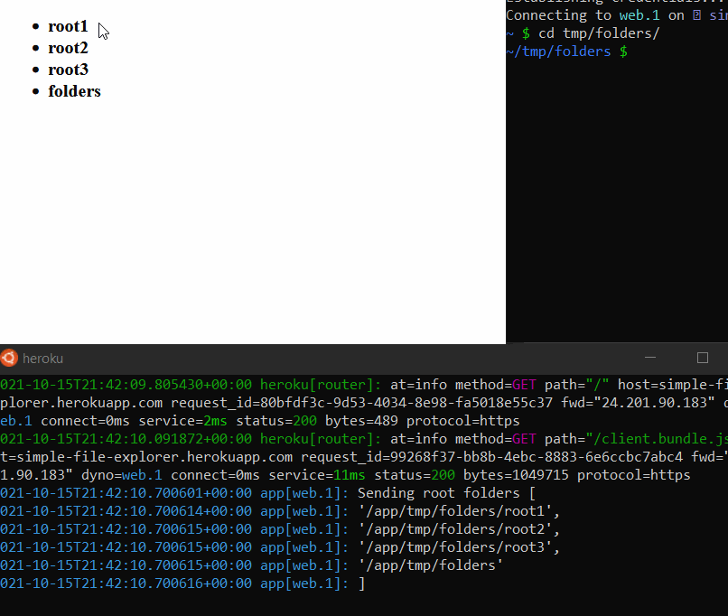
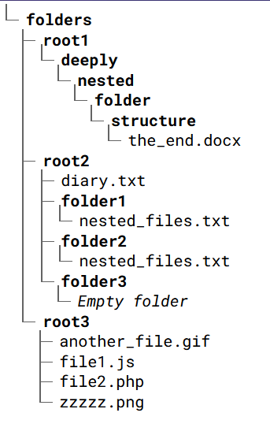

# Simple File Explorer

This is a basic file explorer built with NodeJS and React featuring an efficient real-time file watcher.




# Running

## Local Demo

```
git clone https://github.com/knyzorg/simple-file-explorer # Clone repository
cd simple-file-explorer
npm i # Install dependencies
npm run open ~/Desktop/ ./an/index-dir/ # Open folders
```

## Heroku Demo

A demo is available on [Heroku](https://simple-file-explorer.herokuapp.com/) but doesn't feature real-time change detection, as there are no changes.

You can deploy it yourself, and use the `heroku ps:exec -a app_name` command to access the directories.

[](https://heroku.com/deploy)

The Heroku deployment creates a `~/tmp/folders/` directory full of folders and files. It can be recreated by running `./scripts/generate-folders.sh`.

# Architecture

## Packages Used:

- Koa for HTTP server
- React for front-end
- WS for WebSocket communication

The NodeJS server has a FileWatcher that manages File System watchers. It is used to subscribe to changes in a directory multiple times while only using a single Inotify handle which is disposed when no longer in use.

The front-end is built with plain React and is compiled by webpack for static serving.

State between the two is synchronized by sending messages over WebSockets using WebSockets [`ws`](https://github.com/websockets/ws) on the server and [native WebSockets](https://developer.mozilla.org/en-US/docs/Web/API/WebSocket) on the client.

## Communication Protocol

The communications between client and server are limited to 2 types of commands `FileEvent` and `FolderEvent`, sent over WebSockets.

### Server to client

The server pushes `FileEvents` to the client:

```ts
FileEvent {
  eventType: EventType;
  filename: string;
  pathname: string;
}
```

The possible event types are:

- `unlink`: File or Folder deleted
- `file`: File created
- `folder`: Folder created
- `empty`: Folder is empty
- `root`: Add root directory

`FileEvent`s can be batched and sent as an array.

Upon first connecting, the first communication from the server is to send the client each root directory to display.

### Client to Server

When opening or closer a directory, the client informs the server that it wishes to subscribe or unsubscribe from it:

```ts
FolderEvent {
  type: "open" | "close";
  pathname: string;
}
```
